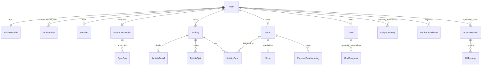

# Stride Production Architecture Review

Prepared September 9, 2026. Architecture proposal, not an implementation or a security audit of running code. The inspected package manifest contains Next.js 16, React 19, and Tailwind 4, not an existing Expo app or backend. Preserve the web project; introduce mobile and API applications separately when implementation starts.

## 1. Executive Architecture Summary

Build **Stride**, a runner application, as an Expo mobile client backed by a NestJS modular monolith, PostgreSQL, Prisma, and one background-worker process. Use TanStack Query for server state, Zustand for small client-only state, and a PostgreSQL-backed durable job library such as pg-boss. AI is an optional backend module, disabled in V1.

**There is a product feasibility gate before the Strava-based roadmap can be approved.** The current official Strava API Policy, effective June 1, 2026, states:

- Section 5.3 prohibits Strava data and derived data in AI operation, not just model training.
- Sections 5.4 and 5.5 restrict analytics, combining data, and persistent storage; Section 6.2 permits only a transient cache of up to seven days.
- Section 5.2 restricts competing applications. Activity history and performance features warrant explicit review.
- Section 6.3 requires reflecting source deletions within 48 hours. Revocation/deletion obligations extend across controlled systems, including derived data.
- New apps start at one connected athlete; exceeding ten requires review. A 2,000-user application does not automatically have permission for 2,000 Strava connections.

Consequently, **do not ship indefinite Strava history, Strava-derived goals or shoe totals, or Strava-fed AI on the assumption that user consent makes them permissible.** Obtain written clarification/authorization covering the exact product, storage, calculations, processors, deployment topology, and capacity. This is an engineering reading of the published terms, not legal advice.

The design below supports durable activities from independently permitted sources. Strava-specific persistence and derived calculations are explicitly conditional on authorization. Without it, offer only approved, short-lived Strava display functionality, and keep Stride-owned profile, gear, and goals independent. Do not relabel imported data as first-party data to bypass restrictions. Independent manual entries are a possible product fallback, not a silently approved replacement for the requested integration.

## 2. Recommended High-Level Architecture

```text
Expo iOS / Android
  | HTTPS / REST / Stride bearer token
  v
NestJS API ----------------------> Object storage
  |                               (Stride-owned profile/gear images)
  +----> PostgreSQL
  |       | domain tables
  |       | expiring provider cache
  |       + durable jobs / sync state
  |
  + OAuth callback / webhook ingress
                 |
                 v
          Background worker <---- PostgreSQL jobs
                 |
                 +----> Strava API (sole Strava credential consumer)
                 +----> Email / Expo Push
                 +----> Optional AI provider (eligible data only)
```

API and worker share one codebase and domain modules. They are separate processes for reliability, not microservices. PostgreSQL is a shared dependency, not an HTTP forwarding hop. Screens read Stride's API, never Strava directly. Strava network failures must not make profile or gear CRUD unavailable.

Keep OAuth exchanges and provider calls in the integration worker, with the API persisting callback work. This centralizes refresh coordination and quota accounting. Confirm deployment interpretation of Policy Section 5.16 with Strava before spreading provider credentials across processes or replicas.

## 3. Mobile Application Architecture

**Stack:** Expo development builds, React Native, TypeScript, NativeWind, React Navigation native stacks and bottom tabs, TanStack Query, Zustand, Expo SecureStore, and AsyncStorage. Use the Expo-compatible versions of native dependencies. Do not add Expo Router alongside React Navigation unless deliberately replacing the navigation choice.

**Navigation:** auth stack for welcome, register, email verification, login, forgot/reset password; authenticated tabs for Dashboard, Activities, Gear, Goals, Profile. Each tab owns a native stack. Activity details, route, splits, gear editor, goal editor, connection status, and session management are feature screens. Optional AI opens from insights or a secondary screen; it is not the primary navigation identity.

**Screen boundaries:** screens orchestrate queries and navigation; feature hooks express query keys and mutations; reusable components render states; one API client manages authorization, refresh, errors, and cancellation. Keep calculations shared with the backend only where presentation requires them, such as unit formatting. Never put database rules into screen components.

**UI states:** use initial skeletons only when there is no cached data; retain existing content during refetch; distinguish empty history, filtered-out results, missing permission, and partial import. Display last successful sync, stale/offline status, retry timing, and reconnect-required errors. Pull-to-refresh reloads Stride data; a separate sync command requests upstream work.

**Lifecycle:** connect React Query's focus manager to AppState and online manager to network status. On foreground, refresh relevant stale data and connection state, not every cached endpoint. Stop status polling when backgrounded. Mobile background execution is best-effort and unnecessary for reliable Strava sync, which runs on the server even when the app is closed.

**Links:** configure verified iOS Universal Links and Android App Links for OAuth completion, password reset, and notification destinations. Validate path and identifiers, require authentication before loading protected content, and handle both cold and warm launches. Keep access/refresh tokens out of URLs. OAuth completion can simply reopen the connection screen, which reads authenticated server status.

**Notifications:** request permission contextually, register installation-specific push tokens, remove invalid tokens, and respect preferences. Push means “refresh this resource,” never “trust this payload as state.” Avoid route, health, and other sensitive information on lock screens.

**Scope:** V1 imports and presents runs; it does not imply live GPS recording. Recording later needs an explicit foreground/background-location design, battery testing, permission review, and crash-safe local samples.

## 4. Backend Architecture

Use NestJS modules with thin controllers, application services, Prisma persistence, and typed DTO validation. Domain rules live in services or small pure functions. Use adapter interfaces for Strava, mail, object storage, and AI, where implementations genuinely vary.

| Module | Owns | Boundary |
| --- | --- | --- |
| Auth | Credentials, identity providers, sessions, reset/verification tokens | Issues Stride credentials; does not own Strava OAuth |
| Users | Account lifecycle, deletion/export coordination | User identity is the ownership root |
| Profile | Experience, preferences, units, timezone, photo | No upstream token fields |
| Strava | Consent, encrypted credentials, provider cache, webhooks, jobs, quotas | Converts approved provider data into typed activity input |
| Activities | Canonical permitted activities, details, splits, gear assignment | Sole owner of activity writes and eligibility rules |
| Gear | Gear metadata, shoe extension, external mappings | Reads activity contributions; does not blindly increment mileage |
| Goals | Definitions, periods, progress rules | Computes from eligible activities, not client-supplied progress |
| Dashboard | User-scoped read composition | Does not become a second source of business truth |
| Notifications | Preferences, devices, delivery | Receives minimal identifiers, loads approved message content |
| AI | Conversations, provider adapter, data eligibility, budget | Core modules never require AI success |

This is a domain-organized modular monolith with selected clean/hexagonal boundaries, not a full ceremony-heavy implementation of those patterns. Avoid generic repositories wrapping every Prisma call, distributed events, separate databases per module, and services for every entity. In-process service calls plus transactions are sufficient.

## 5. Database Architecture

Use UUID primary keys for Stride entities. Represent Strava IDs as PostgreSQL bigint or strings, and serialize them as strings over JSON to avoid JavaScript integer precision problems. Use timestamptz for instants, a separate IANA timezone for calendar semantics, and date for purchase dates. Store meters and seconds; convert units at the boundary. Prices use integer minor units plus ISO currency, never floating-point money.

| Entity | Important fields and constraints |
| --- | --- |
| User | id, normalizedEmail unique, status, createdAt, updatedAt, deletionRequestedAt |
| AuthIdentity | userId FK, provider, subject; unique(provider, subject); do not auto-link by email |
| PasswordCredential | userId unique FK, passwordHash, changedAt; absent for social-only accounts |
| Session | id, userId FK, refreshTokenHash unique, familyId, expiresAt, revokedAt, rotatedAt; retain rotation metadata for replay detection |
| AuthActionToken | userId, purpose, tokenHash unique, expiresAt, consumedAt |
| RunnerProfile | userId PK/FK, displayName, photoKey, experience, preferences JSONB, units, timezone |
| StravaConnection | id, userId unique FK, athleteId unique, encrypted access/refresh tokens, keyVersion, expiresAt, scopes, status, generation, lastSuccessAt |
| OAuthAttempt | hashed state unique, userId, connection intent, expiry, consumedAt; short-lived |
| SyncRun | id, connectionId, mode, status, cursor, counts, coverage, errorCode, retryAt, timestamps |
| Activity | id, userId FK, source, externalId nullable, sportType, startedAt, timezone, distanceMeters, movingSeconds, elapsedSeconds, averageHr, maxHr, cadence, elevationMeters, calories, sourceFetchedAt, expiresAt nullable, deletedAt, version |
| ActivityDetail | activityId unique FK, polyline, bounded stream JSONB, photo references, weather metadata and provenance; fetched separately |
| ActivitySplit | id, activityId FK, splitKind, splitIndex, distanceMeters, movingSeconds, elevationMeters, averageHr; unique(activityId, splitKind, splitIndex) |
| Gear | id, userId FK, type, brand, model, purchasedOn, priceMinor, currency, notes, retiredAt, version |
| Shoe | gearId PK/FK, expectedLifeMeters, surface, openingMileageMeters; only valid for shoe-type Gear |
| ExternalGearMapping | userId, provider, externalGearId, gearId FK; unique(userId, provider, externalGearId) |
| ActivityGear | userId, activityId FK, gearId FK, role, assignmentOrigin; unique(activityId, gearId); at most one primary shoe per activity |
| Goal | id, userId FK, type, targetValue, targetUnit, period/start/end, timezone, ruleVersion, criteria JSONB, version, archivedAt |
| GoalProgress (later) | goalId, periodStart, value, calculatedAt, sourceRevision; unique(goalId, periodStart) |
| DailySummary (later) | userId, localDate, sportType, aggregate fields, sourceRevision; unique(userId, localDate, sportType) |
| DeviceInstallation | userId, installationId, pushToken, platform, lastSeenAt; unique installation identity |
| AIConversation (later) | id, userId FK, title, createdAt, deletedAt |
| AIMessage (later) | id, conversationId FK, role, content, status, model, usage, createdAt; bounded retention |

**Ownership:** every authenticated query filters by the session user. Activities, gear, and goals cannot be assigned across users. Use composite ownership FKs where practical, such as (activityId, userId) and (gearId, userId), plus transactional application validation for shoe type and role. Index foreign keys explicitly; PostgreSQL does not automatically index the referencing side.

**Duplicate prevention:** unique(userId, source, externalId) for provider activities, with externalId required when source is Strava. Keep this unique constraint even on soft-deleted rows so retries do not resurrect duplicate identities. The unique athlete connection prevents linking the same provider identity to two Stride accounts. Provider cache expiry may remove the row entirely; re-fetch is then a new cache fill, not duplicate lifetime mileage.

**Indexes:** Activity(userId, startedAt DESC, id DESC), Activity(userId, sportType, startedAt), ActivityGear(gearId, activityId), Goal(userId, archivedAt), Session(userId, expiresAt), SyncRun(connectionId, createdAt DESC), and cache expiresAt. Add JSONB indexes only for demonstrated query paths. Prisma migrations may need reviewed SQL for partial unique indexes and CHECK constraints.

**Optional measurements:** null means unavailable, not zero. Summary imports must not overwrite richer details with absent fields. Preserve moving versus elapsed time. Pace is movingSeconds / (distanceMeters / 1000), only for positive distance. Weighted aggregate pace is total time / total distance, not the mean of activity paces. Preserve provider cadence semantics and normalize explicitly rather than guessing steps versus strides.

**Soft deletion and audits:** retire gear and archive goals so legitimate history remains meaningful. Short-lived soft deletion for Stride-owned activities can support undo; provider revocation requires actual purge, not permanent tombstones with personal data. Track updatedAt, version, assignment origin, import run, and minimal security audit events. Do not maintain an indefinite raw-provider-payload audit log.

**Retention boundary:** durable Activity tables apply to data Stride is permitted to retain. Under current public terms, isolate Strava payloads in an expiring cache schema with inherited expiries for details/splits and no durable derived totals. Exclude that cache from long-lived backups and persistent logs. Use the canonical durable import path only after authorization; merely adding expiresAt to an indefinite database is insufficient.

## 6. Strava Integration & Synchronization

### OAuth and token ownership

1. An authenticated Stride user requests a connection attempt. Server creates random, expiring, single-use state bound to that user and an allowlisted return destination.
2. Mobile opens the system authentication browser or supported Strava mobile authorization flow, not an embedded WebView. Request least privilege: activity:read; request activity:read_all only when private activity access is needed and explained.
3. HTTPS backend callback verifies state, denial, expiry, and accepted scopes. It persists short-lived exchange work, then returns to the app without credentials in the link. Do not trust a userId from callback parameters.
4. Integration worker exchanges the one-use code with the server-held client secret, verifies athlete identity, encrypts credentials, and queues initial synchronization. Encrypt any temporarily queued authorization code and delete it after use. Stride login and Strava connection remain distinct.
5. Mobile reads connection status. Interrupted browser flows can resume from server status without a second account or duplicate import.

Use PKCE for supported public-client identity flows. Do not assume Strava supports undocumented PKCE parameters: its documented exchange uses the server client secret. State validation remains mandatory.

Strava access tokens currently last approximately six hours; use returned expires_at, not a hardcoded timer. Refresh only when needed, with a safety margin. Serialize refreshes per connection across workers using a durable lease with expiry/fencing. Persist the latest returned refresh token and access token atomically. Re-read credentials after acquiring the lease. A process-local mutex alone fails with multiple workers. A crash between provider rotation and database commit can still require reconnect; surface it rather than promising impossible cross-system atomicity.

### Initial and incremental work

- Start with a visible bounded window, for example the latest 30 days, and show coverage explicitly. Full historical import is conditional on retention authorization and quota; it is never a blocking HTTP request.
- Import paginated summaries first. Fetch details/streams only for selected activities or approved features requiring them. Heart rate, cadence, calories, photos, splits, and routes depend on activity/device/scope/API availability; weather is optional and may need another licensed source and consent.
- Checkpoint each completed page/window only after committed writes. Use a fixed upper bound for a backfill, overlapping windows for reconciliation, and unique upserts so concurrent additions do not become duplicates. A creation-time cursor is not a complete change-data feed.
- Webhooks drive new activity processing. Manual sync and sparse reconciliation repair gaps. Do not poll each athlete every few minutes. Old edits, deletions, and backdated uploads need explicit handling; a recent-window poll cannot guarantee complete historical consistency.
- Track coverage separately from operational status: recentWindowComplete, historicalBackfillComplete, detailAvailability, and lastSuccessfulReconciliation. Never label a partial import as “all history synced.”

### Webhooks

Maintain one subscription per Strava application, not one per athlete. GET verification must check the verify token and return the challenge. POST must validate a small payload, durably enqueue it, and return HTTP 200 within Strava's two-second deadline. If persistence fails, return an error so upstream retries rather than falsely acknowledging lost work.

Strava's published webhook contract does not provide a per-delivery HMAC signature. The subscription verification token does not authenticate subsequent POSTs. Use an unguessable callback path, subscription/owner validation, strict size/rate limits, and provider re-fetch before trusting activity changes. Handle suspicious destructive events conservatively while immediately hiding potentially inaccessible data. Do not invent signature verification that Strava does not offer.

Treat events as duplicated, out of order, and incomplete. Deduplicate identical payloads with a short-lived fingerprint; activity upserts remain the primary correctness mechanism. Re-fetch current provider state rather than applying old event snapshots. Worker jobs check connection generation before and after external requests so disconnect cannot race with an import. Privacy changes may appear as deletion when scopes no longer allow access.

### Quotas, errors, and status

Use one application-wide quota controller for both overall and read limits, tracking 15-minute and daily usage headers. Reserve capacity for new activities and user-requested detail; throttle historical backfill first. Limits depend on approved capacity and can change; the API dashboard and response headers are authoritative. The published page contains different default and upgraded-tier examples, so do not hardcode one global allowance.

For perspective, 2,000 athletes x 300 historical activities x 2 detail calls is 1.2 million calls. Infrastructure scaling does not solve that quota problem. Even refreshing seven-day caches for many users can be expensive; fetch only useful approved resources and seek capacity approval.

| Failure | Action |
| --- | --- |
| Network timeout / 5xx | Exponential backoff with full jitter, bounded attempts and request timeout |
| 429 | Pause until provider reset/retry timing; daily exhaustion may wait until midnight UTC |
| 401 | One coordinated refresh and retry; invalid refresh becomes reconnect_required |
| 403 | Report missing permission or access issue; do not repeatedly retry blindly |
| 404 / loss of access | Remove/hide cached resource and repair authorized derived state |
| Invalid payload | Quarantine minimal diagnostics for operator review; no infinite retries |
| Worker crash | Job lease expires; replay safely from committed checkpoint |

Expose queued, running, partial, succeeded, retry_scheduled, failed, reconnect_required, disconnecting, and disconnected states, with processed counts, imported/updated/skipped counts, lastSuccessAt, coverage, and nextRetryAt. Show useful sanitized errors, not upstream secrets or stack traces.

### Disconnect and deletion

Disable reads and new jobs immediately, increment connection generation, revoke upstream credentials through the documented revoke endpoint, and purge provider data plus derivatives from server caches, devices, logs, and any permitted backups. Retain revocation credentials only in tightly restricted short-lived work until retry completes. Current documentation recommends POST /oauth/revoke; the older deauthorize endpoint is scheduled to cease support June 1, 2027.

Current policy requires source deletions to be reflected within 48 hours and revocation deletion expeditiously, with a 30-day outer deadline in Section 7.4. Section 2.5 uses broader “all Data” wording; resolve that scope before promising independent Stride data survives disconnect. Give written deletion confirmation. Offline devices cannot receive immediate purge instructions: for V1, do not persist Strava payloads to disk, and require online revalidation before displaying them after resume. This makes the limitation explicit instead of claiming guaranteed remote erasure of an offline phone.

### Shoe mileage and goals: authorized data only

The technical relationship is provider gear ID -> ExternalGearMapping -> Gear/Shoe, while provider activity -> Activity -> ActivityGear. Unknown gear can create a placeholder for user confirmation. A deliberate local shoe override wins over subsequent provider sync unless the user explicitly resets it.

**Never run mileage += distance on every import.** In V1, calculate shoe usage as openingMileageMeters plus SUM(distanceMeters) over active eligible activities assigned to that shoe. Duplicate imports do not change the sum; edits, deletions, and reassignment naturally repair it. Opening mileage is a user-supplied pre-history baseline, not the provider lifetime total added to imported history. Explain coverage to avoid accidental overlap. A later cached counter must use transactional old/new deltas and periodic rebuilds.

Goal definitions are durable; progress is initially computed from indexed activity queries. Weekly/monthly mileage uses half-open local-calendar intervals converted to UTC using the goal timezone. Fix week start and timezone semantics when creating the goal; do not silently rewrite history when a phone changes timezone.

First 5K/10K/half/marathon goals mean at least one qualifying running activity meeting an explicit distance threshold. A distance-only activity does not prove an officially measured race result. Pace goals specify distance range, time basis, and required count; do not use “best instantaneous pace.” Custom goals use supported typed criteria or manual completion, not arbitrary executable expressions. Label manually tracked goals honestly.

Store targets, rules, and ruleVersion; return computed progress, period, and asOf. Progress can decrease when activities are deleted or reclassified. Later GoalProgress snapshots and DailySummary rows are rebuildable projections, not competing truth. No Strava-derived goal, gear, or dashboard computation is enabled by default under the current policy restrictions.

## 7. State Management

| Location | What belongs there | What does not |
| --- | --- | --- |
| Component state | Input text, focused controls, modal visibility | Shared activity history |
| Zustand | Selected filters, temporary draft coordination, non-sensitive UI preferences | Copies of Query activity/goal/gear lists or refresh tokens |
| TanStack Query | API results, pagination, mutation lifecycle, stale status | Canonical business truth |
| AsyncStorage | Small preferences, per-user permitted query cache, recoverable drafts | Tokens, provider payloads, full route/health archives |
| SecureStore | Stride refresh credential, small device secrets | Large JSON datasets or Strava tokens |
| Backend/PostgreSQL | Accounts, permissions, permitted activities, rules, progress calculations, jobs | Ephemeral screen state |

Keep access tokens in memory and refresh through one single-flight API client. Namespace query keys and persistence by user; clear on logout/account switch. A response started under one user must not populate another user's cache. Bound persisted cache by age and size, version its schema, and exclude sensitive or restricted fields.

Initial stale-time policy: dashboard/activity lists about 60 seconds, goal/gear metadata several minutes, explicit invalidation after mutation. These are tuning defaults, not freshness guarantees. Provider cache expiry overrides Query staleTime. Query garbage collection and persistence maxAge are separate settings.

## 8. API Design

Use /v1, JSON, ISO-8601 timestamps, string external IDs, explicit units, and OpenAPI-generated mobile types. Never ship Prisma model types as the public contract. Return only allowlisted fields. Responses below omit the /v1 prefix.

Authenticated endpoints use Stride bearer authentication unless marked public. All owned IDs require user-scoped lookup; a UUID is not authorization. Mutating versioned resources require If-Match or expectedVersion. Use 412 for stale preconditions, 409 for domain conflicts, 422 for invalid input, 429 for throttling, and structured errors: {code, message, fieldErrors?, requestId}. Return 404 for inaccessible owned resources.

| Method and endpoint | Request -> response | Authentication and important validation |
| --- | --- | --- |
| POST /auth/register | email, password -> 202 verification pending | Public; email normalization, password policy, generic anti-enumeration response |
| POST /auth/verify-email | one-use token -> 204 | Public; hash lookup, purpose, expiry |
| POST /auth/login | email, password -> accessToken, refreshToken, expiresIn, user | Public; throttling, verified account, generic failure |
| POST /auth/google | provider credential and flow nonce -> Stride token pair | Public; verify provider signature, issuer, audience, expiry, nonce; code/PKCE where applicable |
| POST /auth/apple | identity token, authorization code, nonce -> Stride token pair | Public; verify Apple claims/code and retain name only when initially supplied |
| POST /auth/refresh | refreshToken -> rotated token pair | Refresh credential; transactional replay detection |
| POST /auth/logout | current session credential -> 204 | Session/refresh credential; revoke session and clear local state |
| POST /auth/forgot-password | email -> 202 | Public; generic response, rate limit |
| POST /auth/reset-password | one-use token, newPassword -> 204 | Public; token expiry, revoke existing sessions |
| GET /auth/sessions | none -> session metadata list | Bearer; no hashes/tokens exposed |
| DELETE /auth/sessions/:id | none -> 204 | Bearer; ownership, recent authentication for sensitive operations |
| GET /users/me | none -> account DTO | Bearer |
| DELETE /users/me | confirmation -> 202 deletion job | Bearer plus recent authentication; revoke sessions, coordinate data purge |
| POST /users/me/export | permitted export request -> 202 job | Bearer; privacy scope and provider export restrictions |
| GET /users/me/profile | none -> profile and version | Bearer |
| PATCH /users/me/profile | name, units, timezone, preferences -> updated profile | Bearer; allowlisted fields, valid timezone, lengths, version |
| POST /users/me/photo-upload | mime, size -> signed upload URL/key | Bearer; size/type bounds, private bucket and finalize validation |
| POST /strava/connection-attempts | return destination enum -> authorizationUrl, attemptId | Bearer; fixed redirects, CSRF state |
| GET /strava/callback | code/state or error -> redirect to app | No bearer; one-use server-bound state; no secrets in redirect |
| GET /strava/connection | none -> scopes, status, sync summary | Bearer; no tokens |
| POST /strava/sync-runs | recent/backfill mode -> 202 runId | Bearer; connected scopes, quota, coalesce active request, backfill authorization |
| GET /strava/sync-runs/:id | none -> status, coverage, counts, retryAt | Bearer; owner-scoped run |
| DELETE /strava/connection | none -> 202 disconnect job | Bearer; block access immediately, idempotent cleanup |
| GET /webhooks/strava/:secret | challenge/verify token -> challenge JSON | Provider handshake validation, no Stride bearer |
| POST /webhooks/strava/:secret | provider event -> 200 | Hardened ingress; durable enqueue; provider verification as described above |
| GET /activities | cursor, limit, dates, sport -> items, nextCursor | Bearer; max 50, stable (startedAt,id) cursor, bounded dates |
| GET /activities/:id | none -> metrics/detail availability | Bearer; source access and expiry check |
| GET /activities/:id/route | resolution -> bounded polyline | Bearer; allowed resolution, no automatic full streams |
| GET /activities/:id/splits | kind -> ordered split list | Bearer; validated split kind |
| PUT /activities/:id/gear | primaryShoeId, accessoryIds -> assignments/version | Bearer; same-owner gear, role/type, expected version |
| GET /gear | type, active, cursor -> gear with computed mileage | Bearer; bounded page |
| POST /gear | type, brand/model, purchase data, shoe fields -> 201 gear | Bearer; idempotency key, nonnegative money/distance, currency, type checks |
| PATCH /gear/:id | editable fields/retiredAt -> gear/version | Bearer; expected version; mileage is not writable except baseline |
| GET /goals | status, cursor -> definitions and computed progress | Bearer; bounded page and period |
| POST /goals | typed target, dates, timezone -> 201 goal | Bearer; idempotency key, valid target units and supported criteria |
| PATCH /goals/:id | definition or archive -> goal/version | Bearer; expected version; automatic progress is read-only |
| GET /dashboard | period -> totals, trends, goals, gear, coverage, asOf | Bearer; bounded period, user-scoped aggregates |
| PUT /notifications/installations/:id | push token, platform -> 204 | Bearer; installation ownership and token bounds |
| POST /ai/conversations | title? -> 201 conversation | Bearer; feature gate and quota; later only |
| POST /ai/conversations/:id/messages | text, clientRequestId -> 202 message/job | Bearer; size, ownership, eligibility, budget, idempotency |
| GET /ai/conversations/:id/messages | cursor -> messages/status | Bearer; ownership; no provider internals |

Use request-scoped idempotency keys for retried creates, stored with user, route, request hash, and result for a documented finite TTL. Reusing a key with a different body is a conflict. Do not automatically retry non-idempotent POSTs without that contract.

Dashboard V1 runs a small set of indexed SQL aggregate queries for eligible data, plus goals and gear, in one API request. This is **on-demand database calculation**, not loading every activity into Node or the phone. Return consistent period and coverage semantics. If cross-widget snapshot consistency matters, use a short read transaction. No scheduled summary jobs or Redis cache are necessary initially.

## 9. Security

- Issue short-lived Stride access JWTs, for example 10 minutes, with explicit algorithm, issuer, audience, exp, and session identifier validation. Rotate signing keys. Do not include health/location details in claims.
- Use cryptographically random opaque refresh tokens with a finite lifetime, for example 30 days. Store only hashes server-side, rotate transactionally, detect replay, and revoke the family. Serialize client refresh and test network-loss/retry behavior; strict replay handling can legitimately require re-login after an ambiguous refresh result.
- Logout revokes refresh immediately; otherwise an issued JWT survives until expiry. For immediate revocation, check session status on protected requests in V1 using an indexed session lookup, or explicitly document the short access-token window. Sensitive actions always check current session/account state.
- Hash passwords with Argon2id using measured parameters. Email verification, reset tokens, credential linking, and account deletion need abuse protection and recent-auth checks. Use mature JOSE/OIDC libraries, not homemade cryptography. Never merge identities solely because emails match.
- Store mobile refresh tokens in Expo SecureStore. AsyncStorage/MMKV are not credential vaults. Handle reinstall/keychain behavior, device lock, and revoked sessions without assuming device persistence is trustworthy.
- Encrypt Strava tokens with authenticated encryption and a managed key outside PostgreSQL. Restrict decrypt permission to the integration runtime. Database encryption at rest is useful but does not replace field-level token protection.
- Validate DTOs, reject unknown sensitive fields, bound arrays/payloads, and enforce ownership on every query and mutation. Parameterize Prisma raw SQL; never interpolate filters or ORDER BY fragments from users.
- Use HTTPS only. CORS governs browser behavior, not native clients or attackers; configure allowed web origins but never treat CORS as authentication. Apply gateway and account/IP limits to auth, sync, uploads, and AI.
- Expo public environment variables and mobile bundles contain no secrets. Backend secrets belong in managed secret storage, separated by environment. Redact authorization headers, codes, reset links, push tokens, route points, and provider payloads from logs.
- Treat running routes and physiological data as sensitive. Use private image storage, signed URLs, scoped retention, export/deletion procedures, and a breach-response plan. Test backup restoration without resurrecting deleted data.

## 10. Scalability

| Scale | Concrete response |
| --- | --- |
| About 2,000 users | One API instance and one worker, managed PostgreSQL, indexes, pooled connections, bounded jobs and queries. Load-test the actual data volume. Seek Strava capacity approval before launch. |
| About 10,000 users | Measure API saturation and queue age; add API replicas if needed, tune worker concurrency within approved quotas, add daily summaries for demonstrated query cost. Current Strava policy identifies 10,000+ as an Extended Access approval boundary. |
| About 100,000 users | Larger database and explicit storage budgeting, controlled worker pools, hot read summaries/cache, potentially read replicas; partition high-volume tables only when measurements justify it. Revisit provider agreements and budget before infrastructure. |

User count alone is not a capacity model. At 2,000 users with 1,000 historical activities each, there are two million activities; full streams may dominate storage and egress long before basic SQL aggregates fail. Measure active users, activities per day, historical depth, requests per screen, payload size, peak concurrency, and provider calls per import.

Likely bottlenecks: Strava quotas first; then stream payloads, poorly indexed historical queries, database connections, job retries, and AI spend if enabled. Place a hard cap on each process's connection pool: replicas multiply connections. Add replicas and caches based on p95 latency, CPU, IO, and queue lag, not a fixed user-number milestone.

## 11. Performance

**Mobile:** use FlatList initially, stable keys, pagination, and small row DTOs. Consider FlashList after profiling, not by default. Keep expensive chart transforms outside render loops. Downsample series before rendering; load full detail only on demand. Do not mount a map for each list row. Load thumbnails with expo-image, bound image/cache sizes, unmount heavy maps when appropriate, and avoid keeping every visited route in Query memory. Measure release builds on midrange Android and older iPhones; development performance is misleading.

Keep bundle dependencies lean: avoid multiple date/chart/state libraries, audit native packages, and do not ship provider SDKs when a small backend contract suffices. Cancel obsolete requests, fetch independent screen resources concurrently, and use the dashboard endpoint to avoid network waterfalls. Do not apply React memoization everywhere without profiling.

**Backend:** select only required columns, batch relation reads, avoid N+1 queries and offset pagination deep in history. Analyze expensive queries with EXPLAIN ANALYZE against production-like data. Keep streams out of list queries and large transactions. Cap page sizes and chart resolutions. Compression helps JSON transfer but does not excuse oversized responses.

Start without server response caching. If repeated dashboard queries are expensive, add short user-scoped caches with mutation invalidation, then rebuildable daily summaries. Enforce provider deletion/expiry through every cache layer; Redis is not a substitute for correct SQL or authorization.

## 12. Offline & Network Failure Strategy

Choose an **online-first app with selective persistence**, not a bidirectional offline database in V1.

| Storage option | Decision |
| --- | --- |
| AsyncStorage | Use for small UI preferences, recoverable goal/gear drafts, and bounded permitted non-sensitive query cache |
| MMKV | Postpone; faster synchronous preferences do not solve sync or security |
| Expo SQLite | Add when offline history/search or live recording is explicitly required; use native encryption if required and supported by the build |
| Other SQLite bindings | No initial benefit over Expo integration |
| SecureStore | Only small credentials/secrets; never a full activity cache |

| Situation | V1 behavior |
| --- | --- |
| Open without internet | Show last permitted persisted profile/gear/goals with stale indicator; no claim that cached access proves a valid server session |
| Previously loaded activities | Independently permitted cached activity summaries may remain readable within TTL; uncached details show unavailable. For Strava, disable offline redisplay until online source/access revalidation under the current policy. |
| Create/edit goal offline | Persist an explicitly unsent draft. Do not claim success or alter authoritative progress. |
| Edit gear offline | Persist draft similarly; retain base version for later conflict detection. |
| Connection returns | Refresh active queries; offer draft submission after comparing version. Do not silently replay an unlimited mutation queue. |
| Strava sync fails | Keep valid current data, show last successful time/coverage and retry or reconnect action; core account and gear functions remain usable. |

For online goal/gear mutations, optimistic presentation is reasonable: snapshot cache, show pending state, rollback on failure, and invalidate on success. Never optimistically invent imported activities, sync completion, or shoe mileage. A timed-out create uses the same idempotency key when retried so an ambiguous server success cannot duplicate the resource.

If offline editing becomes a requirement later, add SQLite drafts/outbox, client-generated IDs, idempotency keys, versions, retry bounds, and a conflict UI. That is a deliberate feature investment, not a necessary V1 dependency.

## 13. Background Jobs

A durable queue is justified **from V1** because initial import, webhook deadlines, retries, and provider quotas already require work to outlive HTTP requests. Use pg-boss with a dedicated PostgreSQL job schema and a separate worker entry point. This avoids a new Redis dependency. Verify the selected version's transaction integration with Prisma; do not assume separate client connections share a transaction.

For guaranteed handoff, persist a small pending-work record in the same Prisma transaction as the domain change; the worker dispatches it to the library with a unique key and marks it dispatched. This is local reliable job dispatch, not a Kafka/event-driven architecture. At-least-once execution plus idempotent writes is the contract; never promise exactly-once external side effects.

Jobs: OAuth exchange, initial sync page, activity fetch/update, reconciliation, revoke/purge, retention sweep, email, and optional notification. Later: aggregate repair and eligible AI request. Bound concurrency, execution time, payload size, attempt count, and completed-job retention. Store identifiers rather than raw activity data in payloads.

Give new activities priority over backfill, fair-share work across athletes, and serialize per connection when needed. Retry transient failures with jitter; quarantine permanent failures with a manual replay tool. Scheduled cache purges are necessary now, whereas scheduled dashboard aggregation is not. Preserve critical job metadata across deployment and test shutdown/recovery.

## 14. Observability

**Day one:** structured JSON logs with requestId, pseudonymous user reference, jobId, syncRunId, duration, outcome, and sanitized error code. Use Sentry for mobile/API/worker exceptions with PII scrubbing. Track API p50/p95/p99, 5xx rate, database pool saturation, slow queries, job queue age, retries, dead jobs, sync success/lag, and both Strava quota windows.

Monitor failed logins/reset abuse, refresh replay, revoked connections, webhook acknowledgement latency, cache expiry/purge lag, and backup success. Alert when webhook p99 approaches two seconds, jobs stall, credentials fail broadly, or retention deadlines risk violation. Log sync counts and coverage rather than raw activities. Database errors need query fingerprints, not sensitive parameter dumps.

When AI exists, monitor provider errors, latency, token usage, and per-user/global spend; do not log prompts by default. Later add OpenTelemetry tracing and mobile performance telemetry if cross-process debugging warrants them. Do not send Strava activity data into product analytics; operational counters should remain minimal and consistent with permitted use.

## 15. Testing Strategy

**Mobile:** unit-test formatters, period labels, and draft logic; React Native Testing Library tests for loading/error/empty/stale states, mutations, and validation. Navigation tests cover auth gating and deep-link routing. Maestro device flows cover registration/login, connect callback, activity detail, gear assignment, goal editing, session expiry, offline launch, and account switch. Use release-like Expo development/preview builds for real native authentication tests.

**Backend:** unit-test goal eligibility, timezone boundaries/DST, weighted pace, gear mapping/override rules, retry decisions, and redaction. Integration/API tests use Jest and Supertest against real PostgreSQL, preferably Testcontainers; SQLite is not a substitute for PostgreSQL constraints and transaction behavior. Test migrations on an empty database and an upgrade fixture.

**Critical contract test:** mocked Strava OAuth -> accepted scopes -> queued sync -> imported activity -> dashboard query -> goal progress -> shoe mileage. This flow is enabled only for permitted data/authorized integration settings. Assert the same event delivered twice changes totals once. Then change distance, change shoes, delete the activity, replay an older event, and disconnect during a running fetch. No duplicate or resurrection is allowed.

Also test expired tokens, concurrent refresh, provider-rotation crash recovery, 429 daily exhaustion, pagination interruption, backdated activities, missing metrics, privacy changes, cross-user IDs, forged webhooks, retention expiry, backup restore purge, and failed job replay. Use synthetic fixtures rather than retained real athlete payloads.

Live staging smoke tests use designated consenting test accounts and minimal quota. Do not hit Strava from every CI run. Add a policy regression test: Strava-tagged and derived data must not reach the AI adapter or durable analytics path without the appropriate independently reviewed permission gate.

## 16. Deployment Architecture

Use **Expo EAS Build/Submit** for mobile, **Render paid API service + background worker**, **managed PostgreSQL in the same region**, and private S3-compatible object storage for Stride-owned images. Start with one API process and one integration worker. Avoid free services that sleep when webhooks must be acknowledged promptly. This is a practical starting deployment, not a claim of measured capacity.

Development uses local PostgreSQL and mocked Strava responses; use a controlled HTTPS tunnel for occasional webhook testing. Staging has its own database, secrets, mobile application identifiers, push setup, and provider configuration. Production uses a stable api.stride.example-style HTTPS domain configured into an EAS production build. That URL is public configuration, never a secret; physical devices do not use localhost to reach your laptop.

Respect the one-subscription-per-Strava-app rule: do not point a production subscription at a development tunnel. Obtain approval for appropriate test/provider configurations rather than creating extra apps to evade quotas. Do not copy production personal data into staging.

CI gates lint, typecheck, tests, and reviewed migrations. Run migrations once as a deployment task, not on every replica startup. Use backward-compatible expand/contract changes because old installed mobile versions remain in use. Add health/readiness checks and graceful worker shutdown. Separate queue metadata backup from the provider cache retention design; managed PostgreSQL defaults may require a separate transient store/database if they cannot exclude expiring data from long-lived backups.

Use point-in-time recovery for permitted durable data and conduct restore drills. Define recovery objectives and a tested deletion replay procedure. EAS updates must match runtime/native compatibility; native module or permission changes require a new store build.

## 17. Recommended Folder Structure

Proposed organization, not folders already created. Preserve the existing Next.js app until there is a specific migration task. Share API contracts, not backend database clients or secrets.

```text
apps/mobile/
  App.tsx
  src/
    navigation/          # Auth stack, tabs, feature stacks, links
    features/
      auth/ profile/ activities/ strava/ gear/ goals/ dashboard/
      ai/                # Later, optional
    components/          # Shared presentation primitives
    api/                 # HTTP client, generated contracts, query keys
    state/               # Small Zustand stores
    storage/             # SecureStore, cache policy, draft persistence
    theme/
    test/

apps/api/
  src/
    main.ts              # HTTP entry
    worker.ts            # Worker entry, same application modules
    modules/
      auth/ users/ profile/ activities/ strava/ gear/ goals/
      dashboard/ notifications/ ai/
    infrastructure/
      database/ jobs/ crypto/ mail/ object-storage/ observability/
    common/              # Guards, validation, error mapping only
  prisma/
    schema.prisma
    migrations/
  test/
    integration/
    e2e/
packages/contracts/      # Generated OpenAPI types; no Prisma leakage
```

Inside a feature, start with screen/controller, service/hook, DTO/types, and tests. Add domain/adapters subdirectories when actual complexity requires them. Do not create empty architectural layers for every feature.

## 18. Core Database Entity Relationship Diagram



Goal progress depends on qualifying activities through rule-based queries, not a permanent FK from every activity to every goal. The diagram describes the permitted-data domain. Strava data remains an expiring integration cache unless a reviewed authorization permits its durable participation.

## 19. Critical User Flows

```text
Register -> verify email -> create runner profile
    -> connect Strava -> server-bound OAuth callback
    -> approved initial sync queued -> quota-controlled fetch
    -> permitted activity upsert committed
    -> dashboard / goals / gear queries reflect the committed data
    -> optional AI insight only for independently eligible data
```

Dashboard, goal, and gear updates are not a fragile chain where each screen triggers the next job. In V1 their queries derive from the same committed eligible activity data, so reopening the app cannot skip mileage or goal updates. With later projections, the UI shows calculatedAt/coverage while idempotent jobs catch up.

**Policy gate:** the full Strava -> durable Activity -> Goal/Gear chain is conditional; do not present it as available under current public terms. Strava -> AI is disabled. For an approved cache-only integration, the flow ends at authorized transient activity display.

**Changed activity:** worker re-fetches -> transaction updates activity and valid gear mapping -> query invalidation on next foreground/status completion -> sums reflect the new value. Explicit local shoe overrides survive the refresh.

**Disconnect:** block provider reads -> invalidate connection generation -> cancel/reject queued imports -> revoke -> purge/cache invalidation -> confirm deletion. A late worker response cannot recreate removed data.

**Offline edit:** retain original gear/goal version plus draft -> reconnect -> fetch latest -> submit with version -> resolve conflict or show saved state. No hidden overwrite of a second device's edits.

**AI later:** request -> authenticate -> verify data provenance/eligibility -> bounded summary of eligible first-party data -> provider adapter -> validate/store result -> return insight. No unrestricted SQL tools, autonomous goal changes, or training on user histories. Add user consent, spending limits, timeouts, and appropriate non-medical coaching boundaries. AI failure does not affect sync or dashboard rendering.

## 20. Build Now vs Build Later

| Build Now: prototype / production V1 | Build Later | Avoid |
| --- | --- | --- |
| Obtain Strava product, retention, calculation, deployment and capacity decisions | Expanded history only with permission/quota | Assuming consent overrides provider terms |
| Expo app, five core tabs, clear failure/coverage states | Live run recording and richer offline history | Treating Stride AI as the product |
| Secure email/Google/Apple auth and sessions for production | Additional identity providers if demanded | Handwritten auth cryptography |
| Profile, gear, typed goals, eligible activity list/details | Richer custom goal builder | Arbitrary goal expressions |
| NestJS monolith, PostgreSQL, Prisma, durable jobs | Worker scaling when approved and measured | Microservices, Kubernetes, Kafka |
| Idempotent sync, quota control, explicit connection status | Advanced reconciliation after measured need | Per-user frequent polling |
| Indexed on-demand eligible aggregates | Daily summaries and short cache if slow | Premature data warehouse/CQRS/event sourcing |
| SecureStore, bounded permitted cache, offline drafts | SQLite outbox when offline editing is required | Syncing full database to every phone |
| Logs, errors, backups, purge procedures, critical tests | Distributed tracing, read replicas if justified | Unbounded provider payload logging |
| AI boundary defined, implementation disabled | Small eligible-data AI module with cost controls | Vector DB, RAG, agent framework by default |

For a hackathon, prioritize a thin vertical slice with synthetic data and one authorized athlete, then harden it. A personal-use prototype is not evidence that a 2,000-user Strava integration is approved. Do not market unapproved functionality as production-ready.

## 21. Architecture Risks

| # | Risk | Mitigation |
| --- | --- | --- |
| 1 | Requested Strava storage/analytics/AI violates current terms | Written product-specific review; disable gated paths; independently permitted core data |
| 2 | Athlete capacity or API quota blocks launch | Apply early, model call demand, show coverage, throttle backfill; no capacity guarantee |
| 3 | Duplicate/replayed imports inflate gear or goals | Unique source IDs, idempotent upsert, derive sums from canonical rows |
| 4 | Token rotation races disconnect users | Cross-process lease/fencing, atomic persistence, reconnect path for irrecoverable ambiguity |
| 5 | Revocation/deletion races restore private data | Connection generation checks, immediate access block, source verification and tested purge/restore |
| 6 | Mobile or API exposes another user's data | User-scoped queries/composite ownership, per-user cache partitioning, authorization tests |
| 7 | Webhooks lost, spoofed, or incompletely describe changes | Fast durable ingress, hardened callback, re-fetch, bounded reconciliation, honest freshness |
| 8 | Goal/mileage semantics drift with edits or timezones | Versioned typed rules, SI units, fixed calendar semantics, rebuildable progress, explicit baseline |
| 9 | History/streams overwhelm database or phone | Bounded pagination, detail separation, downsampling, retention, production-like profiling |
| 10 | Background or AI failures become invisible/costly | Queue-age alerts, retry limits, quarantine/replay, provider timeouts and spending caps |

## 22. Final Recommendation

1. **Mobile:** Expo + React Native + TypeScript + NativeWind + React Navigation, organized by runner-facing features.
2. **Backend:** NestJS domain-organized modular monolith, one HTTP process and one worker from the same codebase.
3. **Database:** managed PostgreSQL + Prisma, normalized permitted activity data, strict ownership/uniqueness, isolated expiring Strava cache.
4. **Strava:** server-owned OAuth, encrypted credentials, serialized rotation, hardened webhooks, approved data uses only.
5. **Synchronization:** background summary-first import, idempotent upserts, webhooks plus bounded reconciliation, explicit coverage and repair states.
6. **State:** TanStack Query for server state, Zustand only for client UI coordination, backend as the canonical authority.
7. **Caching:** selective bounded AsyncStorage persistence for permitted data; no offline Strava payload persistence in V1; no Redis initially.
8. **Background processing:** pg-boss and a durable database handoff, bounded retries, quotas, and per-connection coordination from day one.
9. **Security:** short-lived Stride JWTs, hashed rotating refresh credentials, SecureStore, verified identity-provider flows, user-scoped authorization, managed secret encryption.
10. **Deployment:** EAS mobile builds, paid Render API/worker, same-region managed PostgreSQL, private image storage, isolated environments and tested recovery.

This gives Stride a realistic path from personal prototype to thousands of users without redesigning its core. **The immediate blocker is not selecting infrastructure: it is whether Strava will authorize the product's requested durable history and derived functionality.** Resolve that before committing to a Strava-dependent launch. AI remains optional and must not process Strava data under the current published policy.

### Official Sources Checked

- [Strava API Agreement, effective June 1, 2026](https://www.strava.com/legal/api)
- [Strava API Policy, effective June 1, 2026](https://www.strava.com/legal/api_policy), especially Sections 2.5, 3.3, 5.2-5.5, 5.16, 6.2-6.3, and 7.4
- [Strava authentication and revocation documentation](https://developers.strava.com/docs/authentication/)
- [Strava webhook documentation](https://developers.strava.com/docs/webhooks/)
- [Strava rate limits and athlete capacity](https://developers.strava.com/docs/rate-limits/)

These sources were read for this proposal. Public policy and documentation can change; validate the approved terms and actual API dashboard configuration before implementation and release. No backend/mobile implementation or runtime capacity tests were performed as part of this architecture review.